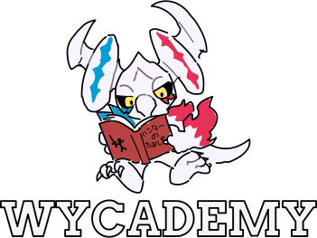

# wycademy

A compendium of resources for Monster Hunter Frontier Z (MHF-Z).

## Feedback

We have a [Google Forms](https://forms.gle/hfFG7QWNcrCHnDV67) where you can submit your feedback on the website.

If you have found bugs, or want to suggest a new feature in the website, you can also submit an issue in [our GitHub issue tracker.](https://github.com/DorielRivalet/wycademy/issues)

## License

[MIT](https://github.com/DorielRivalet/wycademy/blob/main/LICENSE.md).

## Acknowledgements

- The theme and color palette used by the website is [*Catppuccin*](https://github.com/catppuccin/catppuccin).
- The design and icons used in this project are part of [*Carbon Design System*](https://github.com/carbon-design-system/carbon-components-svelte).
- The typeface is [IBM Plex](https://github.com/IBM/plex). Additional fonts used is the in-game one, *MS Gothic*, and the Monster Hunter font made by [XMitsarugiX](https://www.deviantart.com/xmitsarugix/art/Monster-Hunter-Font-Type-1-and-2-380816151).
- The combo element icons are made by [Narwhaler](https://fanonmonsterhunter.fandom.com/wiki/User:Narwhaler).
- Items, Weapons, Armor, Carve and Tools icons are made by [Jeremiah V10](https://fanonmonsterhunter.fandom.com/wiki/User:Jeremiah_V10).
- The render for Golden Deviljho and Shifting Mi Ru are made by [Siroos](https://monsterhunter.fandom.com/wiki/User:Siroos).
- Additional game icons can be found [in the Fanon Wiki](https://fanonmonsterhunter.fandom.com/wiki/Category:Icon). Icons based on these are licensed under CC-BY-SA unless otherwise specified.
- Element icons (such as Dark, Music and Sound) are based on [MHFZZDatabase](https://github.com/theMaelstro/MHFZZDatabase) icons. Monster icons (like Burning Freezing Elzelion, Shifting Mi Ru, Arrogant Duremudira, Ruling Guanzorumu, Blinking Nargacuga, Yama Kurai and Thirsty Pariapuria) are also based on [MHFZZDatabase](https://github.com/theMaelstro/MHFZZDatabase) icons. **Icons by silversoulart, as credited in theMaelstro’s repository.**
- **All other images are either official CAPCOM assets used under fair use, based on official CAPCOM assets, or are original creations made for Wycademy.**
- **Gear data (weapons, armor, decorations, sigils, etc.), Monster data (hitzones, elements, ailments, etc.), Items data, and other general game information are based on the work of [S.A.](https://x.com/PoisonBake2) ([Website](http://ferias.life.coocan.jp/), also known as Ferias), [Yuuburo's blog](https://yuuburo.blog.jp/), [hiroaki362](https://x.com/hiroaki362) ([MHSX2G](https://hiroaki362.hatenablog.com/entry/2019/07/28/175411)) ([Website](https://www.byuwa.com/)) and contributions from the [Monster Hunter Wiki](https://monsterhunter.fandom.com/wiki/Monster_Hunter_Frontier), [Monster Hunter Encyclopedia Wiki JP](https://wikiwiki.jp/nenaiko/) and [atwiki](https://w.atwiki.jp/giurasu/) communities.**

**Wycademy is committed to proper attribution and respect for intellectual property. Our [copyright page](https://wycademy.vercel.app/support/policies/copyright) details our policies, and any concerns can be submitted via our [GitHub issue tracker](https://github.com/DorielRivalet/wycademy/issues). We're always open to good-faith discussions and making corrections where needed.**

### Attribution

Some assets used in Wycademy are derived from CAPCOM’s *Monster Hunter Frontier Z* and are used under **fair use** for documentation and preservation.
Additional attributions for fan-made or community contributions can be found in [our credits document](CREDITS.md). See also our [Attribution Policy](ATTRIBUTION-POLICY.md).
