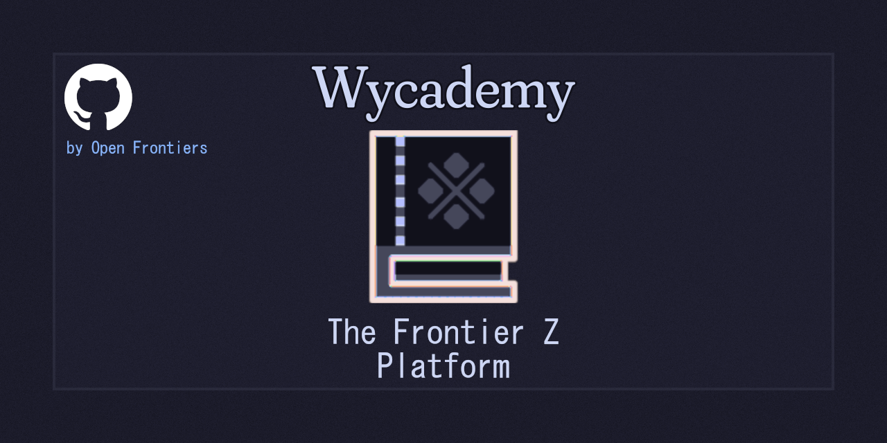

# wycademy



[Website](https://wycademy.vercel.app/)

## Project Overview

Wycademy is an open-source platform, knowledge base, database, and speedrunning leaderboard for *Monster Hunter Frontier Z*. It serves as a hub for:

- **Game Data & Guides** – Weapons, armor, skills, monsters, and more.
- **Speedrun Leaderboards** – Secure and community-driven ranking system.
- **Tools & Utilities** – Calculators, overlays, and other resources.
- **Preservation & Documentation** – Archiving essential game information for future players.

Our goal is to provide **an accessible, well-organized, and reliable resource** for the *Monster Hunter Frontier Z* community.

---

## **Getting Started** (For Developers & Contributors)

### Cloning the Repository

```sh
git clone https://github.com/DorielRivalet/wycademy.git
cd wycademy
```

### Installation & Setup

Ensure you have **Node.js** and **npm** installed.

```sh
npm install # Install dependencies
npm run dev -- --open # Start the development server
```

For a full guide on setting up your environment, check our [Development Guide](./docs/DEVELOPMENT.md).

---

## Contribution Guidelines

We welcome contributions! You can help by:

- Fixing bugs & implementing features – Check [issues](https://github.com/DorielRivalet/wycademy/issues).
- Improving documentation – Clarify guides, add missing details.
- Submitting feedback – Use [our Google Forms](https://forms.gle/hfFG7QWNcrCHnDV67) or open an issue.

See our [CONTRIBUTING.md](./CONTRIBUTING.md) for more details.

---

## Feature Roadmap & Planned Updates

We’re actively developing Wycademy, with plans to:

- **Expand leaderboards** – Better verification, new categories.
- **Enhance UI/UX** – Improve accessibility and mobile experience.
- **Optimize search tools** – Faster armor set calculations.

You can track progress via our [GitHub Projects](https://github.com/DorielRivalet/wycademy/projects).

---

## Community & Support

- **Feedback & Bug Reports** – [Submit an issue](https://github.com/DorielRivalet/wycademy/issues).
- **Speedrun Support & Submissions** – Details available on the [website](https://wycademy.vercel.app/leaderboard).

---

## License & Legal

Wycademy is licensed under the [**MIT License**](https://github.com/DorielRivalet/wycademy/blob/main/LICENSE.md). This means:

- You are free to use, modify, and distribute the project.
- We provide it "as-is" with no warranty.

### Attribution & Fair Use

- Some assets are derived from *Monster Hunter Frontier Z* and used under **fair use** for documentation.
- Full attribution details can be found in [CREDITS.md](./CREDITS.md) and [ATTRIBUTION-POLICY.md](./ATTRIBUTION-POLICY.md).

More legal details: [Copyright Policy](https://wycademy.vercel.app/support/policies/copyright).

---

## Acknowledgments

Special thanks to the following sources and contributors:

- **Theme & UI Design** – [Catppuccin](https://github.com/catppuccin/catppuccin), [Carbon Design System](https://github.com/carbon-design-system/carbon-components-svelte).
- **Fonts & Icons** – [IBM Plex](https://github.com/IBM/plex), *MS Gothic*, *Fraunces* for the Wycademy logo, Monster Hunter fonts by [XMitsarugiX](https://www.deviantart.com/xmitsarugix/art/Monster-Hunter-Font-Type-1-and-2-380816151).
- **Game Data Sources (gear, weapons, motion values, armor, decorations, sigils, monster hitzones, elements, ailments, items, locations, etc.)** – [S.A.](https://x.com/PoisonBake2) ([Website](http://ferias.life.coocan.jp/), also known as Ferias), [Capcom Online Games' website](https://web.archive.org/web/20190623215505/http://cog-members.mhf-z.jp/gamedata/skill/), [Capcom Online Games' Game Manual](https://web.archive.org/web/20190623215658/http://cog-members.mhf-z.jp/sp/manual/page435.html), [Yuuburo's blog](https://yuuburo.blog.jp/), [hiroaki362](https://x.com/hiroaki362) ([MHSX2G](https://hiroaki362.hatenablog.com/entry/2019/07/28/175411)) ([Website](https://www.byuwa.com/)).
- **Community Contributors** – The [Monster Hunter Wiki](https://monsterhunter.fandom.com/wiki/Monster_Hunter_Frontier), [Monster Hunter Encyclopedia Wiki JP](https://wikiwiki.jp/nenaiko/) and [atwiki](https://w.atwiki.jp/giurasu/).

For the full list of credits, see [CREDITS.md](./CREDITS.md).

### Attribution

Some assets used in Wycademy are derived from CAPCOM’s *Monster Hunter Frontier Z* and are used under **fair use** for documentation and preservation.
Additional attributions for fan-made or community contributions can be found in [our credits document](CREDITS.md). See also our [Attribution Policy](ATTRIBUTION-POLICY.md), [past credits document](PAST-CREDITS.md), [licenses page](https://wycademy.vercel.app/support/policies/licenses) and [third-party licenses folder](./THIRD-PARTY-LICENSES/).

---

## Links & Resources

- **[Website](https://wycademy.vercel.app/)** – Full database, tools, and leaderboards.
- **[GitHub Issues](https://github.com/DorielRivalet/wycademy/issues)** – Report bugs & request features.
- **[Development Guide](./docs/DEVELOPMENT.md)** – Setup and contributing instructions.

---

We’re always improving Wycademy—thanks for checking it out! 🎮🔥
