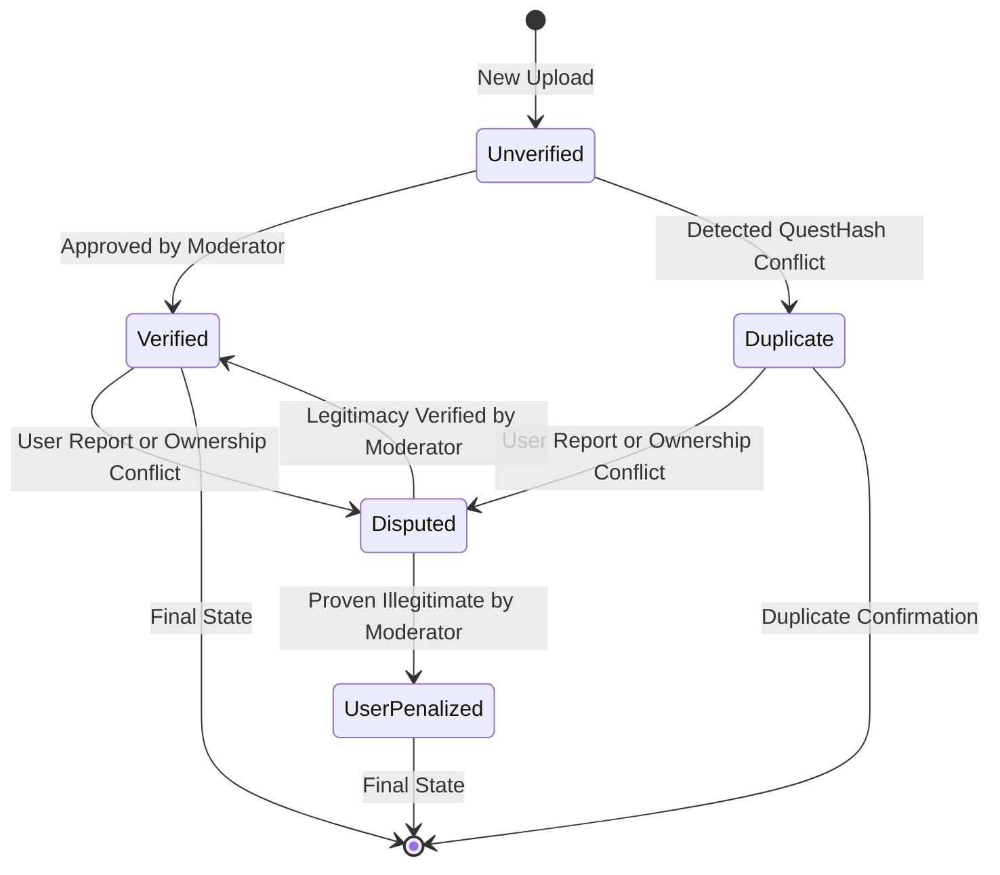

# Quests

## Status

| **Status**       | **Display**                             | **Notes**                                                                                     | **Shown in Profile** | **Shown in Leaderboard** |
|-------------------|-----------------------------------------|-----------------------------------------------------------------------------------------------|-----------------------|--------------------------|
| **Unverified**    | Pending moderator review               | Default status for all newly uploaded runs that are not duplicates or possesses a blank VideoLink.                           | ✅                   | ✅                      |
| **Verified**      | A moderator has reviewed this quest    | Manually approved runs that meet all criteria (e.g., valid `VideoLink`, no duplicate issues). | ✅                   | ✅                      |
| **Duplicate**     | This run is marked as a duplicate      | Runs flagged as duplicates due to matching `QuestHash` with an existing submission.           | ✅                   | ❌                      |
| **Disputed**      | Under review due to user reports or ownership conflicts | Flagged for manual review (e.g., cheating or ownership issues).                               | ✅                   | ❌                      |

- Duplicated quests are automatically deleted after a certain period of time. Ownership is verified by confirming the user owns the account where the `VideoLink` submission happened. This can be done by them supplying their Wycademy username in the video submission's account bio or description, or the video's title or description. We also check the upload date of the video.
- If a disputed quest ends up being stolen or used cheats, the user is penalized and the quest is removed; otherwise if the quest is legit, it can become verified.
- Duplicate quests can only occur via the upload of another user, since the primary keys are composite: profile_id and quest_hash. When an user uploads multiple runs (same profile_id), if a run was already uploaded (same quest_hash) we skip this row.

## Privileges Matrix

|Role|View Leaderboard|View Profiles|Insert Quests|Update Quest Status|Update User State|Delete Users|
|-|-|-|-|-|-|-|
|Admin|✅|✅|✅|✅|✅|✅|
|Moderator|✅|✅|✅|✅|✅|❌|
|Authenticated|✅|✅|✅|❌|❌|❌|
|Anon|✅|✅|❌|❌|❌|❌|

- Admins have access to the Supabase Dashboard, while moderators do not and operate through the website only.
- Only admins or moderators can change a quest's status.
- User State refers to: banned (cannot access account permanently), suspended (cannot access account temporarily), or time-out (cannot upload new quests temporarily).
- Profiles includes everything that is not leaderboard data, including favorite gear, quests, etc.
- Deleting users deletes all of their data, including quests, gear, followed users, etc.
- Authenticated users cannot delete their own quests in order to preserve leaderboard integrity.
- Authenticated users can only update VideoLink fields (or provide the VideoLink from overlay) once a quest is submitted and not any other field. Valid VideoLink fields are from: YouTube, Bilibili, Niconico, Twitch, Vimeo and archive.org. If a VideoLink later becomes inaccessible, either the user or a moderator can supply a new VideoLink, without affecting the quest's status.
